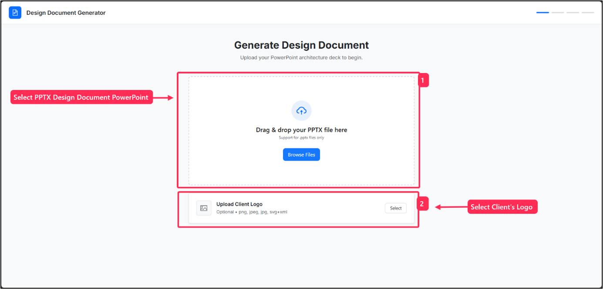
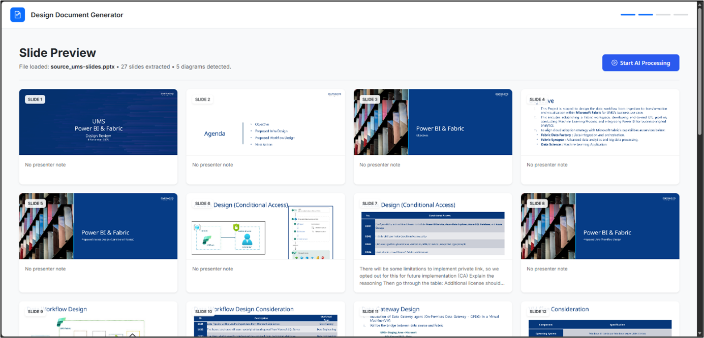
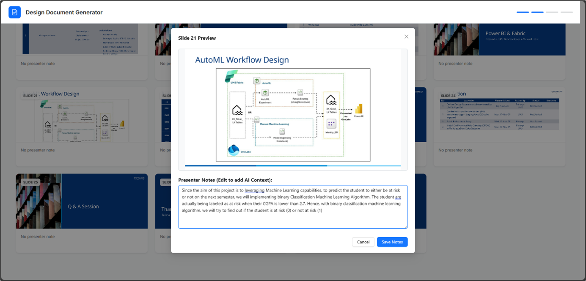
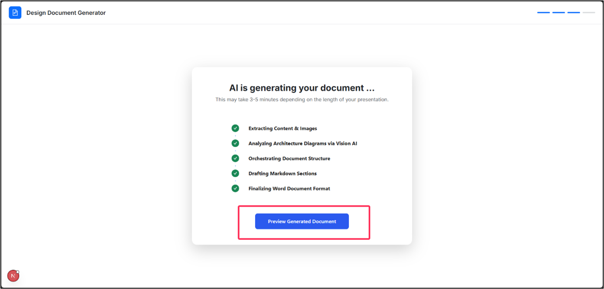
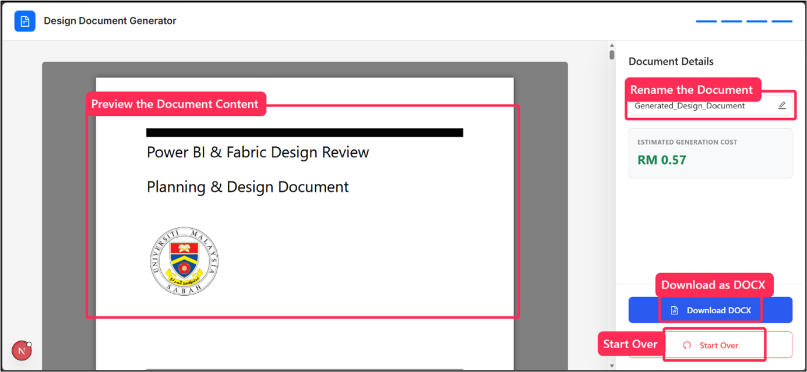
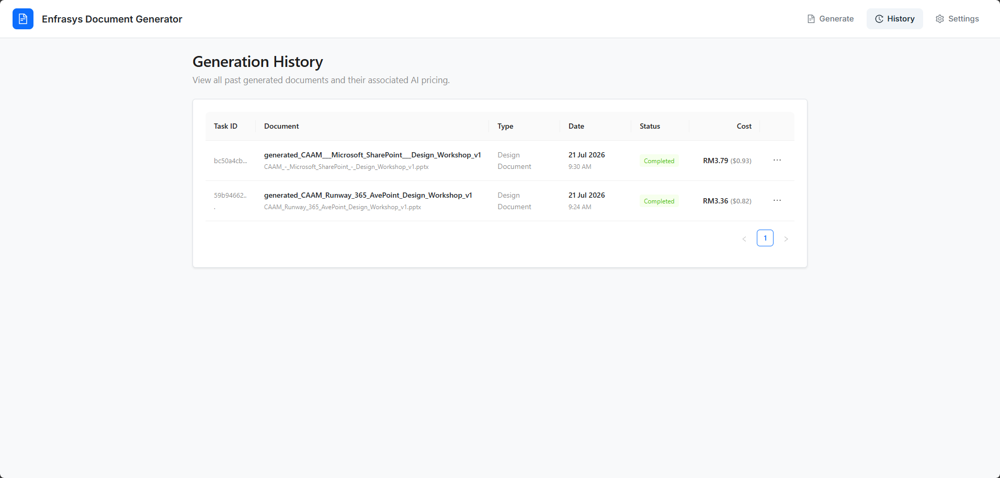
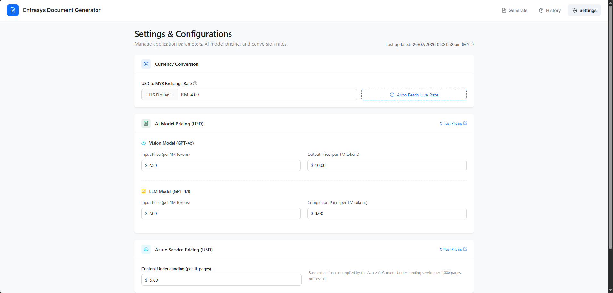

# 📄 Enfrasys Design Document Generator
An intelligent, enterprise-ready web application designed to automatically convert Design Documentation presentations slides (.pptx) into comprehensive, formal Microsoft Word Solution Design Documents (.docx). Powered by Microsoft Foundry (Agentic AI), Azure AI Content Understanding, Azure Cosmos DB, and Azure Blob Storage.

## 📖 Overview
This project provides a Next.js-based frontend for the design document generator UI, and a FastAPI-based backend for the document generation process. In Enfrasys, most of the design document will be created in `.pptx` format. This deck is presented to the customer first hand, before the proper, formal design document in `.docx` format is produced. This tool accelerates the process of drafting that final `.docx` file by intelligently extracting and analyzing the presentation content.

The solution leverages Microsoft AI Services such as the Microsoft Foundry Agentic solution, Azure OpenAI Vision, and Azure AI Content Understanding, together with open-source technologies (like python-pptx) to execute the document transformation with high fidelity. All generated documents and task metadata are persisted to Azure Cosmos DB and Azure Blob Storage for long-term history tracking and retrieval.

## ✨ Key Features
- **Automated Document Generation:** Seamlessly converts uploaded `.pptx` presentations into fully formatted `.docx` design documents.
- **Interactive AI Context:** Users can manually override or add specific AI context (presenter notes) to individual slides, providing targeted guidance for the document generation.
- **Dynamic Cost Estimation:** Transparently calculates and displays the estimated price for generating a specific document based on token usage and slide count, with user-configurable pricing rates (USD & MYR).
- **Custom Document Naming:** Users can rename the generated design document before the final output is produced.
- **Generation History Dashboard:** A dedicated History page to view all past generated documents in a searchable table, complete with task ID, document name, type, date/time, status, and dual-currency cost breakdown.
- **Document Actions:** From the History table, users can View, Download, or Delete any previously generated document directly.
- **Cloud-Persisted Storage:** Generated documents are automatically uploaded to Azure Blob Storage and task metadata is stored in Azure Cosmos DB, ensuring data durability and freeing up App Service disk space.
- **Automatic Server Cleanup:** After a task is completed and persisted to the cloud, all local files are automatically cleaned up to prevent disk exhaustion on the App Service.
- **Agentic AI Orchestration:** Powered by Microsoft Foundry Agentic Architecture (Orchestrator and Writer agents) utilizing GPT-4.1 to dynamically construct a bespoke Table of Contents and generate technical content that maps directly to the provided slides.
- **Advanced Content Extraction:** Deep parsing of slide text, speaker notes, and tables using `python-pptx` and Azure AI Content Understanding.
- **Vision AI Analysis:** Automatic extraction of diagrams and architecture images, which are then analyzed and described by Azure OpenAI Vision (GPT-4o).
- **Modern Web UI:** A sleek, responsive Next.js frontend featuring drag-and-drop file uploads, real-time status polling, interactive slide previews, and a premium History dashboard.

## 🏗️ Architecture
The system consists of a decoupled frontend and backend, supported by Azure cloud services:
1. **Frontend (Next.js):** Handles the user interface, file uploads, progress polling, interactive slide previews, context editing, Settings page (for pricing configuration), and the History dashboard.
2. **Backend (FastAPI):** Exposes REST endpoints to manage background tasks for file processing. It orchestrates content extraction and communication with the Azure AI ecosystem (OpenAI Vision, Content Understanding, and Agentic endpoints) to assemble the final Word document. After generation, it uploads outputs to Azure Blob Storage and persists task metadata to Azure Cosmos DB.
3. **Azure Cosmos DB:** Stores task records (status, cost metrics, document type, generated filename) and user-configurable pricing settings. Enables the History dashboard and cross-session data persistence.
4. **Azure Blob Storage:** Stores all generated document outputs (`.docx`, `.md`, thumbnails) for long-term retrieval, enabling downloads even after the App Service has cleaned up local files.

## 💻 Tech Stack
- **Frontend:** [Next.js](https://nextjs.org/) (React Framework), Ant Design, Bootstrap
- **Backend API:** [FastAPI](https://fastapi.tiangolo.com/), Uvicorn
- **Document Processing:** `python-pptx`, `python-docx`, PyMuPDF (`fitz`), Pandoc
- **AI Orchestration:** Microsoft Foundry (Agentic AI Architecture)
- **Vision & Extraction:** Azure OpenAI (GPT-4o Vision), Azure AI Content Understanding
- **Database:** [Azure Cosmos DB](https://learn.microsoft.com/en-us/azure/cosmos-db/) (NoSQL) — `@azure/cosmos` (frontend), `azure-cosmos` (backend)
- **Storage:** [Azure Blob Storage](https://learn.microsoft.com/en-us/azure/storage/blobs/) — `azure-storage-blob` (backend)
- **Deployment:** Docker, Azure Web App (Linux), [Vercel.com](https://vercel.com/)

## 📋 Prerequisites
Before setting up the project locally, ensure you have the following installed:
- [Node.js](https://nodejs.org/en/) (v18 or higher)
- [Python](https://www.python.org/) (v3.9 or higher)
- [LibreOffice](https://www.libreoffice.org/) (required for PPTX to PDF thumbnail conversion)
- An active Azure Subscription with the following resources provisioned:
  - **Microsoft Foundry** (Azure OpenAI endpoints for GPT-4o and GPT-4.1)
  - **Azure AI Content Understanding** resource
  - **Azure Cosmos DB** account (NoSQL API) with a database named `design-doc-generator` containing `tasks` and `settings` containers
  - **Azure Storage Account** with a Blob container (e.g., `dev-designdocument-storage`)

## ⚙️ Environment Variables

### Backend (`python-backend-dev/.env`)
Create a `.env` file in the backend directory and configure the following variables:
```env
# Azure OpenAI Vision Settings
AZURE_OPENAI_ENDPOINT="<your-vision-endpoint>"
AZURE_OPENAI_KEY="<your-vision-key>"
AZURE_OPENAI_DEPLOYMENT_NAME="<your-vision-deployment-name-e.g-gpt-4o>"

# Microsoft Foundry Agentic Settings
AGENT_OPENAI_ENDPOINT="<your-agent-endpoint>"
AGENT_OPENAI_KEY="<your-agent-key>"
AGENT_ASSISTANT_ID="<your-agent-assistant-id>"
ORCHESTRATOR_DEPLOYMENT="<your-orchestrator-deployment-name-e.g-gpt-4.1>"
WRITER_DEPLOYMENT="<your-writer-deployment-name-e.g-gpt-4.1>"

# Azure AI Content Understanding
CONTENT_UNDERSTANDING_ENDPOINT="<your-cu-endpoint>"
CONTENT_UNDERSTANDING_KEY="<your-cu-key>"

# Azure Blob Storage
AZURE_STORAGE_CONNECTION_STRING="<your-storage-connection-string>"
AZURE_BLOB_CONTAINER_NAME="<your-blob-container-name>"

# Azure Cosmos DB (Task Persistence)
COSMOS_DB_URI="<your-cosmos-db-uri>"
COSMOS_DB_KEY="<your-cosmos-db-key>"
COSMOS_DB_DATABASE="design-doc-generator"
COSMOS_DB_TASKS_CONTAINER="tasks"
```

### Frontend (`nextjs-frontend/.env.local`)
Create a `.env.local` file in the frontend directory:
```env
# Backend API URL
NEXT_PUBLIC_API_URL="http://localhost:8000"

# Azure Cosmos DB (for Settings & History API routes)
COSMOS_DB_URI="<your-cosmos-db-uri>"
COSMOS_DB_KEY="<your-cosmos-db-key>"
COSMOS_DB_DATABASE="design-doc-generator"
COSMOS_DB_SETTINGS_CONTAINER="settings"
COSMOS_DB_TASKS_CONTAINER="tasks"
```

## 🚀 Local Setup

#### **1. Clone the repository:**
```cmd
git clone https://github.com/Muhammad-Idzhans/design-document-converter.git
cd design-document-converter
```

#### **2. Start the Backend (FastAPI):**
```cmd
cd python-backend-dev
pip install -r requirements.txt
python app-dev.py
```

#### **3. Start the Frontend (Next.js):**
Open a new terminal window:
```cmd
cd nextjs-frontend
npm install
npm run dev
```

#### **4. Access the application:**
Open [http://localhost:3000](http://localhost:3000) in your web browser.

## ☁️ **[Backend]** Deployment to Azure Web App
The backend is packaged as a Docker container and hosted on Azure Web App for reliable deployment.

#### **1. Build and Push the Docker Image:**
First, build the Docker image using the provided `Dockerfile` and push it to your public Docker Hub registry.
```cmd
cd python-backend-prod
docker build -t <your-docker-username>/<image-name>:latest .
docker push <your-docker-username>/<image-name>:latest
```

#### **2. Create the Azure Web App**
In the Microsoft Azure Portal, create a new Web App. In the Basics tab, apply the following settings:
- **Publish**: Container
- **Operating System:** Linux
- **Region:** Choose a region (e.g., Southeast Asia)
- **Linux Plan:** P0v3 (Recommended)

#### **3. Configure Container Settings**
Next, navigate to the Container tab during the setup process and configure it to pull your image from Docker Hub:
- **Image Source:** Other Container Registries
- **Access Type:** Public
- **Registry server URL:** https://index.docker.io
- **Image and tag:** `<your-docker-username>/<image-name>:latest`
- **Port:** 8000

#### **4. Configure Environment Variables:**
Navigate to **Settings -> Environment variables** in your Web App.
First, add all the standard variables from your local `.env` file (e.g., endpoints, keys).
Next, add the following Azure-specific App Service variables to ensure the container routes correctly and saves files persistently:

| Variable | Value | Purpose |
|---|---|---|
| `WEBSITES_PORT` | `8000` | Routes traffic to the FastAPI server |
| `WEBSITES_ENABLE_APP_SERVICE_STORAGE` | `true` | Enables persistent file storage |
| `OUTPUT_DIR` | `/home/site/wwwroot/outputs` | Sets the output directory for generated files |
| `AZURE_STORAGE_CONNECTION_STRING` | `<your-connection-string>` | Connects to Azure Blob Storage |
| `AZURE_BLOB_CONTAINER_NAME` | `<your-container-name>` | Specifies the Blob container |
| `COSMOS_DB_URI` | `<your-cosmos-uri>` | Connects to Azure Cosmos DB |
| `COSMOS_DB_KEY` | `<your-cosmos-key>` | Authenticates with Cosmos DB |
| `COSMOS_DB_DATABASE` | `design-doc-generator` | Specifies the Cosmos DB database |
| `COSMOS_DB_TASKS_CONTAINER` | `tasks` | Specifies the tasks container |

#### **5. Enable "Always On":**
To prevent the container from spinning down and causing cold-start delays:
- Navigate to **Settings -> Configuration** (or **General settings**).
- Locate the **Always On** toggle and set it to **On**.
- Click **Save**.

#### **6. Restart and Verify:**
Navigate to the Web App's **Overview** page and click **Restart**. Wait a few moments, then check the Log Stream or navigate to the provided Azure URL to ensure the container has successfully started and is ready to process documents.

## 🖱️ Usage Guide

**1. Upload Presentation**
<!-- TODO: Replace with updated screenshot -->

- Navigate to the frontend application.
- Drag and drop your `.pptx` design deck into the upload area or click the **"Browse Files"** button to select a file.
- Optionally, upload a client logo to be embedded in the final design document.
- Then, click the **"Next: Preview Slides"** button to continue.

**2. Processing & Extraction**
<!-- TODO: Replace with updated screenshot -->


- Once uploaded, the backend will initiate a background process to extract images, content and keynotes from the PPTX file.
- The UI will display a preview of extracted data from each slides.
- Optionally, you may click on of the slides to add extra context to be included in the design document.
- Once you ready, you can click the **"Start AI Processing"** button at the top right corner to continue.

**3. Processing Begins**
<!-- TODO: Replace with updated screenshot -->

- Once you click **"Start AI Processing"**, you will be redirected to a new page where you can monitor the processing status.
- Click **"Preview Generated Document"** to view the processed document.

**4. Final Review & Download**
<!-- TODO: Replace with updated screenshot -->

- Review the generated document preview rendered directly in the browser.
- **Cost Estimation:** View the estimated price for generating the document in both MYR and USD, based on your user-configured pricing settings.
- **Rename:** Optionally rename the document to your preferred title.
- Download your fully formatted, bespoke Solution Design Document in `.docx` format.

**5. Generation History**
<!-- TODO: Add screenshot of History page -->

- Navigate to the **History** tab to view all previously generated documents.
- The table displays: Task ID, Document Name, Document Type, Date & Time, Status, and Cost (RM & USD).
- Click the **⋯** (three-dot) menu on any row to:
  - **👁 View Document** — Opens the document in a read-only review page.
  - **⬇ Download Document** — Downloads the `.docx` directly from Azure Blob Storage.
  - **🗑 Delete Document** — Permanently removes the record from Cosmos DB and deletes associated files from Blob Storage.

**6. Settings**
<!-- TODO: Add screenshot of Settings page -->

- Navigate to the **Settings** tab to configure AI pricing rates.
- Adjust the per-token rates for GPT-4o Vision, GPT-4.1, Content Understanding, and the USD-to-MYR exchange rate.
- These settings are stored in Azure Cosmos DB and are used to dynamically calculate generation costs across the Review and History pages.

---

## 📁 Project Structure
```
design-document-converter/
├── nextjs-frontend/           # Next.js frontend application
│   ├── app/
│   │   ├── api/               # Server-side API routes (history, settings, tasks)
│   │   ├── history/           # History dashboard page
│   │   ├── settings/          # Pricing settings page
│   │   └── tasks/[taskId]/    # Task processing & review pages
│   └── components/            # Reusable UI components
├── python-backend-dev/        # Development backend (local testing)
├── python-backend-test/       # Test backend (Azure test deployment)
├── python-backend-prod/       # Production backend (Azure prod deployment)
├── media/                     # README screenshots
└── sample-testing-document/   # Sample PPTX files for testing
```

---

<div align="center">
  <em>Developed for Enfrasys by Muhammad Idzhans Khairi</em>
</div>
