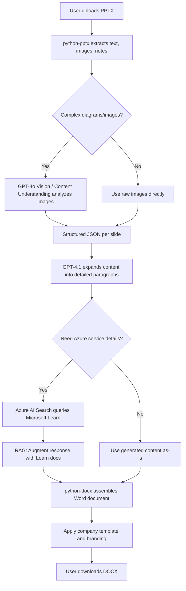

# Solution Architecture: PPTX → DOCX Design Document Converter

## Problem Statement

Pre-sales teams typically create design documents as PowerPoint slides (PPTX) first, as these are presented directly to customers. Afterward, they need to produce a more detailed Word document (DOCX) covering the same content in greater depth.

This process is manual, time-consuming, and repetitive. The goal is to build an **AI-powered solution** that automates the conversion of slide-based design documents into detailed Word documents — transferring text, images, and structure while using **Generative AI** to expand concise slide content into comprehensive written sections.

---

## High-Level Architecture

```
┌──────────┐     ┌─────────────────────┐     ┌──────────────┐     ┌──────────────┐
│  User    │────▶│  Content            │────▶│  GPT-4.1     │────▶│  Document    │
│  Uploads │     │  Understanding      │     │  (Azure      │     │  Generation  │
│  PPTX    │     │  (Extract Text,     │     │  OpenAI)     │     │  (python-    │
│          │     │   Images, Layout)   │     │              │     │  docx)       │
└──────────┘     └─────────────────────┘     └──────────────┘     └──────────────┘
```

---

## Phase 1: Content Extraction

### Option A — Azure AI Content Understanding (Preview)

Azure AI Content Understanding is purpose-built for understanding complex documents including slides.

| Capability              | What It Extracts from PPTX                            |
| ----------------------- | ----------------------------------------------------- |
| **Text extraction**     | Titles, bullet points, speaker notes per slide        |
| **Image extraction**    | Embedded images, diagrams, architecture diagrams      |
| **Layout understanding**| Slide structure, reading order, hierarchy              |
| **Table extraction**    | Any tables within the slides                          |

### Option B — `python-pptx` (Programmatic Extraction)

Use the `python-pptx` library as a first pass to programmatically extract:

- Slide titles and body text
- Embedded images (saved to a temp folder)
- Speaker notes (often contain extra detail the pre-sales team writes)
- Slide ordering and grouping

### Recommended: Hybrid Approach

Use **`python-pptx`** for structured extraction (text, notes, images) combined with **Azure AI Content Understanding** or **GPT-4o Vision** for understanding architecture diagrams and complex visual content that cannot be extracted as raw images alone.

---

## Phase 2: Content Enrichment (GPT-4.1 / Azure OpenAI)

Once structured content is extracted from each slide, it is fed to **GPT-4.1** via **Azure OpenAI Service** to perform the following:

### 2.1 Expand Bullet Points into Detailed Paragraphs

Slides are naturally concise. The AI transforms them into well-written prose suitable for a formal Word document.

### 2.2 Maintain Technical Accuracy

Use a system prompt that instructs GPT-4.1 to act as a Solutions Architect writing a formal design document.

### 2.3 Ground with Microsoft Learn Documentation

Leverage **Azure AI Search** + **Microsoft Learn documentation** as a grounding source via **RAG (Retrieval-Augmented Generation)** to:

- Add relevant Azure service descriptions
- Include best practices and architecture patterns
- Reference official documentation links

### 2.4 Process Slide-by-Slide

Each slide (or group of related slides) becomes a section in the Word document.

### Example Prompt Strategy

```text
You are a Solutions Architect writing a formal design document.
Given the following slide content and images, write a detailed
section for a design document:

SLIDE TITLE: {title}
BULLET POINTS: {bullets}
SPEAKER NOTES: {notes}
IMAGE DESCRIPTION: {ai_description_of_image}

Requirements:
- Expand each bullet point into 2-3 sentences with technical detail
- Reference relevant Azure services and best practices
- Maintain professional tone suitable for customer delivery
- If architecture diagrams are present, describe the data flow
```

---

## Phase 3: Document Assembly (`python-docx`)

Use **`python-docx`** to programmatically create the Word document:

1. **Apply a template** — Use a `.docx` template with company branding (headers, footers, cover page).
2. **Map slides to sections** — Each slide (or group) becomes a numbered section with:
   - Heading (from slide title)
   - Body text (AI-generated expanded content)
   - Images (directly transferred from PPTX)
   - Tables (if any)
3. **Generate Table of Contents** — Auto-generate a ToC.
4. **Add cross-references** — Link related sections together.

---

## Proposed Tech Stack

| Component                      | Service / Tool                                  |
| ------------------------------ | ----------------------------------------------- |
| **Backend API**                | Python FastAPI                                  |
| **Slide Parsing**              | `python-pptx` (structured extraction)           |
| **Image/Diagram Understanding**| Azure AI Content Understanding or GPT-4o Vision |
| **Content Generation**         | Azure OpenAI GPT-4.1                            |
| **Knowledge Grounding**        | Azure AI Search + Microsoft Learn docs          |
| **Document Creation**          | `python-docx`                                   |
| **Frontend** (optional)        | Simple web UI for upload + preview              |
| **Hosting**                    | Azure App Service / Azure Container Apps        |

---

## End-to-End Workflow



---

## Key Considerations

1. **Image Fidelity** — Images should be transferred pixel-perfect from PPTX to DOCX (not re-generated). `python-pptx` can extract them as binary blobs and `python-docx` can insert them directly.

2. **Slide Grouping** — Not every slide equals one section. Some slides are part of a larger topic. Use GPT-4.1 to intelligently group related slides into document sections.

3. **Speaker Notes are Gold** — Pre-sales teams often write detailed notes. These should be used as additional context for the AI to generate richer content.

4. **Iterative Refinement** — Consider a "review and edit" step where the user can review the AI-generated draft before final export.

5. **Cost Optimization** — GPT-4.1 is cost-effective for text generation. Use GPT-4o only for image understanding where needed.

---

## Quick Start: Feasibility POC

For the initial proof-of-concept, use a simplified pipeline:

1. **`python-pptx`** → Extract all slides (text + images + notes) into a structured JSON
2. **Azure OpenAI GPT-4.1** → For each slide's content, generate expanded paragraphs
3. **GPT-4o** → For any architecture diagram slides, describe the image in detail
4. **`python-docx`** → Assemble everything into a formatted Word document

This avoids the complexity of setting up Azure AI Search / Content Understanding for the initial POC, while still demonstrating the core value proposition.

---

## Azure Services Summary

| Azure Service                  | Purpose                                                  |
| ------------------------------ | -------------------------------------------------------- |
| **Azure OpenAI (GPT-4.1)**    | Expand slide content into detailed document sections     |
| **Azure OpenAI (GPT-4o)**     | Vision model for understanding architecture diagrams     |
| **Azure AI Content Understanding** | Extract structured content from PPTX files           |
| **Azure AI Search**            | Index Microsoft Learn docs for RAG grounding             |
| **Azure App Service**          | Host the backend API                                     |
| **Azure Container Apps**       | Alternative hosting with containerized deployment        |
